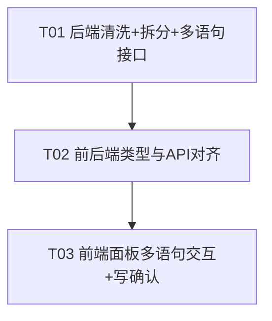

# DBClient MVP — 增量迭代系统设计 + 任务分解：AI 生成 SQL 清洗 + 多语句执行

> 文档版本：v0.2 ｜ 角色：架构师（高见远）｜ 语言：中文
> 配套基线：`docs/architecture.md`（v0.1）、`docs/prd-ai-clean-multistmt.md`（v0.2）
> 落盘路径：`C:\Users\Administrator\myproject\dbclient-mvp`
> 范围声明：本文档**仅覆盖本次增量变更**，不重写整套架构；分层、统一响应、错误码、LIMIT 约定、文件结构均沿用 `docs/architecture.md`。

---

## 1. 实现方案 + 框架选型

### 1.1 本次变更的两件核心事

1. **AI 输出稳健清洗（替换 `stripFences`）**：在 `aiService.ts` 用 `cleanAndSplit()` 取代仅剥离围栏的 `stripFences()`；真正按 `;` 拆分为 `statements: string[]` 的能力下沉到一个独立、可复用的工具 `server/src/utils/sqlSplit.ts` 的 `splitStatements()`，**同时被 `aiService`（清洗）与 `dbService.executeMulti`（拆分）复用**，避免两套拆分逻辑漂移。
2. **多语句执行**：新增 `POST /api/query/execute-multi`，服务端复用 `splitStatements` 拆分入参 `sql`，逐条调用现有 `execute()`（短生命周期连接，与现有架构一致），每条 SELECT 各自按 `shouldApplyLimit` 独立追加 `LIMIT 1000`（沿用现有逻辑），汇总为 `MultiExecResult` 返回；单条失败不阻断其余（`error` 字段承载 50002 文本，顶层 `code` 仍为 `0`）。

### 1.2 技术难点与选型

| 难点 | 选型 / 策略 | 理由 |
| --- | --- | --- |
| SQL 语句拆分需尊重字面量/注释 | 自带轻量**状态机** `splitStatements`（单/双引号、`\'`/`""` 转义、`--` 行注释、`/* */` 块注释内不拆） | 零依赖、可控、足够覆盖 MVP；不引 SQL 解析器重依赖 |
| 围栏剥离 + 解释文字处理 | `stripFences` 提取 ```` ```sql … ``` ```` 内容；无围栏或解释文字残留时**保留**（执行时若非法会报错，符合主理人决策 #4：含解释的段保留，执行报错可见） | 主理人已拍板：不强行截断解释文字，纯解释无 SQL 走 `statements:[]` + 友好提示 |
| 多语句执行隔离 | 逐条 `execute()`，各自 `try/catch` 收集 `error` | 复用现有连接/执行/LIMIT 逻辑，错误隔离天然成立 |
| 写操作二次确认 | 前端纯函数 `isWriteStatement` 前缀关键字判断 + MUI `Dialog` 确认 + localStorage「本次会话不再提示」 | 主理人决策 #1：所有非 SELECT 一律弹窗，MVP 不做细粒度区分 |
| 多语句结果展示 | 前端逐条「可折叠分节」（多 tab 为 P2，暂不做） | 主理人决策 #3 |

### 1.3 框架与架构模式（不变）

- 后端：**Node + Express + TypeScript(ESM)**，分层（route → service → 驱动/工具），mysql2/pg 驱动，无 ORM。**不变**。
- 前端：**Vite + React + MUI + Tailwind + CodeMirror + zustand**。**不变**。
- 契约升级：**完全迁移为 `statements` 字段，前后端同步删除 `sql`**（主理人决策 #6）。
- 事务：MVP 各语句独立执行，不做事务模式（主理人决策 #2）。

---

## 2. 文件列表（仅变更文件，标注「改/新」）

| 文件 | 改/新 | 层 | 说明 |
| --- | --- | --- | --- |
| `server/src/utils/sqlSplit.ts` | **新** | 后端工具 | `splitStatements(sql): string[]` + `stripFences(text): string` + `cleanAndSplit(raw): string[]` |
| `server/src/models/types.ts` | **改** | 后端模型 | `AiGenerateRes` 改为 `{ statements: string[]; model: string }`；新增 `StatementResult`、`MultiExecResult` |
| `server/src/services/aiService.ts` | **改** | 后端服务 | 引入 `cleanAndSplit`；`SYSTEM_PROMPT` 改为允许多条；`generate()` 返回 `statements`（空时返回 `[]`，**不抛 50003**） |
| `server/src/services/dbService.ts` | **改** | 后端服务 | 新增 `executeMulti(conn, sql, opts): Promise<MultiExecResult>`，复用 `splitStatements` + 现有 `execute`，逐条 `try/catch` 隔离 |
| `server/src/routes/ai.ts` | **改** | 后端路由 | 响应字段随 `AiGenerateRes` 变更；`statements` 为空时 `ok(res, result, '友好提示')`（code:0） |
| `server/src/routes/query.ts` | **改** | 后端路由 | 新增 `POST /execute-multi`（zod 校验 `40001`、连接缺失 `40401`、聚合历史一条） |
| `web/src/types/index.ts` | **改** | 前端类型 | `AiGenerateRes` 对齐 `statements`；新增 `StatementResult`、`MultiExecResult` |
| `web/src/api/client.ts` | **改** | 前端 API | `generateSql` 返回 `statements`；新增 `executeMultiQuery(req): Promise<MultiExecResult>` |
| `web/src/store/appStore.ts` | **改** | 前端状态 | `aiResult: string` → `aiStatements: string[]`；新增 `multiResult`/`multiLoading` 字段与 `runMultiQuery` 动作；`generateAi` 写 `aiStatements`；写入确认跳过标记读写辅助 |
| `web/src/components/AiPanel.tsx` | **改** | 前端组件 | 逐条卡片列表 + 单条/全部执行/回填/复制 + 写操作确认触发 + 多语句结果分节折叠展示 |
| `web/src/components/WriteConfirmDialog.tsx` | **新** | 前端组件 | 写操作二次确认弹窗（列明写操作条数、连接名，「本次不再提示」勾选）；可按需合并进 `AiPanel` |

---

## 3. 数据结构与接口

### 3.1 后端类型变更（`server/src/models/types.ts`）

```typescript
// 原 AiGenerateRes = { sql: string; model: string }  →  改为：
export interface AiGenerateRes {
  statements: string[]; // 清洗拆分后的多条 SQL（已去围栏/解释，空段已剔除）
  model: string;
}

// 新增：多语句执行——单条结果
export interface MultiExecStatement {
  sql: string;              // 该条清洗后原文
  result?: QueryResult;     // 成功：单条结果（列/行/行数/耗时/truncated/appliedLimit）
  error?: string;           // 失败：业务错误信息（不含凭据/密文），如 50002 文本
}

// 新增：多语句执行——聚合结果
export interface MultiExecResult {
  statements: MultiExecStatement[]; // 逐条结果（成功含 result，失败含 error）
  successCount: number;
  errorCount: number;
}
```

> `QueryResult`、`QueryExecReq`、`ApiResponse` 等**保持不变**（`QueryExecReq` 直接复用于 `/execute-multi`）。

### 3.2 新增端点 `POST /api/query/execute-multi`

请求体（与 `QueryExecReq` 同形）：

```json
{
  "connectionId": "conn_xxx",
  "sql": "SELECT COUNT(*) FROM users WHERE created_at > DATE_SUB(NOW(),7); UPDATE users SET active=1 WHERE last_login > DATE_SUB(NOW(),1); SELECT * FROM users WHERE active=1;",
  "limit": true,
  "limitValue": 1000,
  "unlimited": false
}
```

成功响应（**整体聚合为 `code:0`，单条失败体现在 `statements[].error`，不上升至顶层错误码**）：

```json
{
  "code": 0,
  "data": {
    "statements": [
      {
        "sql": "SELECT COUNT(*) FROM users WHERE created_at > DATE_SUB(NOW(),7)",
        "result": { "columns": ["COUNT(*)"], "rows": [{ "COUNT(*)": 42 }], "rowCount": 1, "elapsedMs": 23, "truncated": false, "appliedLimit": null }
      },
      {
        "sql": "UPDATE users SET active=1 WHERE last_login > DATE_SUB(NOW(),1)",
        "result": { "columns": ["affectedRows","insertId","warningStatus"], "rows": [{ "affectedRows": 7, "insertId": 0, "warningStatus": 0 }], "rowCount": 7, "elapsedMs": 11, "truncated": false, "appliedLimit": null }
      },
      {
        "sql": "SELECT * FROM users WHERE active=1",
        "error": "SQL 执行失败: Unknown column 'active' in 'where clause'"
      }
    ],
    "successCount": 2,
    "errorCount": 1
  },
  "message": "ok"
}
```

错误码映射（仅入参/连接级错误上升，语句级错误留在 `statements[].error`）：

| 场景 | code | 来源 |
| --- | --- | --- |
| `connectionId` 缺失 / `sql` 为空 | 40001 | zod 校验 |
| 连接不存在 | 40401 | `connectionService.getRecordById` |
| 全部语句成功 / 部分失败（聚合） | 0 | 顶层 success |
| 建连失败 50001 | 上升为顶层 50001 | 连接级（非语句级） |

### 3.3 前端类型变更（`web/src/types/index.ts`）

```typescript
// 原 AiGenerateRes = { sql: string; model: string }  →  改为：
export interface AiGenerateRes {
  statements: string[];
  model: string;
}

export interface MultiExecStatement {
  sql: string;
  result?: QueryResult;
  error?: string;
}

export interface MultiExecResult {
  statements: MultiExecStatement[];
  successCount: number;
  errorCount: number;
}
```

### 3.4 `splitStatements` 工具（`server/src/utils/sqlSplit.ts`，新增）

```typescript
/**
 * 按 `;` 拆分 SQL 为多条语句。
 * 状态机：处于单/双引号字符串字面量、-- 行注释至行末、/* 块注释 *\/ 内时不拆分。
 * 正确识别转义引号（'' 与 ""；MySQL 亦支持 \'）。
 * 拆分后逐条 trim，剔除仅空白 / 仅注释的空语句。
 */
export function splitStatements(sql: string): string[] {
  const stmts: string[] = [];
  let buf = '';
  let i = 0;
  const n = sql.length;
  let inSingle = false;
  let inDouble = false;
  let inLineComment = false;
  let inBlockComment = false;

  while (i < n) {
    const ch = sql[i];
    const next = i + 1 < n ? sql[i + 1] : '';

    // 行注释 -- 至行末
    if (!inSingle && !inDouble && !inBlockComment && ch === '-' && next === '-') {
      inLineComment = true; buf += ch; i++; continue;
    }
    if (inLineComment) {
      if (ch === '\n') { inLineComment = false; buf += ch; i++; continue; }
      buf += ch; i++; continue;
    }

    // 块注释 /* ... */
    if (!inSingle && !inDouble && !inLineComment && ch === '/' && next === '*') {
      inBlockComment = true; buf += ch; i++; continue;
    }
    if (inBlockComment) {
      buf += ch;
      if (ch === '*' && next === '/') { inBlockComment = false; i += 2; continue; }
      i++; continue;
    }

    // 单引号字符串字面量
    if (!inDouble && !inLineComment && !inBlockComment && ch === "'") {
      if (inSingle) {
        if (next === "'") { buf += "''"; i += 2; continue; }      // 标准 SQL 转义 ''
        if (next === '\\') { buf += ch; i++; continue; }            // MySQL 转义 \'（吞转义符）
        inSingle = false; buf += ch; i++; continue;                 // 结束
      }
      inSingle = true; buf += ch; i++; continue;
    }
    // 双引号字符串字面量
    if (!inSingle && !inLineComment && !inBlockComment && ch === '"') {
      if (inDouble) {
        if (next === '"') { buf += '""'; i += 2; continue; }        // 转义 ""
        inDouble = false; buf += ch; i++; continue;
      }
      inDouble = true; buf += ch; i++; continue;
    }

    // 分号分隔（仅语句级、非字面量/注释内）
    if (ch === ';' && !inSingle && !inDouble && !inLineComment && !inBlockComment) {
      const t = buf.trim();
      if (t && !isCommentOnly(t)) stmts.push(t);
      buf = ''; i++; continue;
    }

    buf += ch; i++;
  }
  const tail = buf.trim();
  if (tail && !isCommentOnly(tail)) stmts.push(tail);
  return stmts;
}

/** 仅含空白或仅含注释的语句视为空。 */
function isCommentOnly(s: string): boolean {
  const stripped = s
    .replace(/\/\*[\s\S]*?\*\//g, '')
    .replace(/--[^\n]*/g, '')
    .replace(/'[^']*'/g, '')
    .replace(/"[^"]*"/g, '')
    .trim();
  return stripped === '';
}

/** 剥离 ```sql ... ``` / ``` ... ``` 围栏，保留内部内容（可能含多条）。 */
export function stripFences(text: string): string {
  let s = (text ?? '').trim();
  const m = /^```(?:sql)?\s*([\s\S]*?)\s*```$/i.exec(s) || /```(?:sql)?\s*([\s\S]*?)\s*```/i.exec(s);
  if (m) s = m[1].trim();
  return s;
}

/** AI 原始返回 → 结构化 statements：先剥围栏，再按状态机拆分，剔除空段。 */
export function cleanAndSplit(raw: string): string[] {
  return splitStatements(stripFences(raw));
}
```

### 3.5 `executeMulti`（`server/src/services/dbService.ts`，新增）

```typescript
import { splitStatements } from '../utils/sqlSplit.js';
import type { MultiExecStatement, MultiExecResult } from '../models/types.js';

export async function executeMulti(
  conn: ConnectionRecord,
  sql: string,
  opts: ExecuteOptions = {}
): Promise<MultiExecResult> {
  const statements = splitStatements(sql);
  const results: MultiExecStatement[] = [];
  for (let idx = 0; idx < statements.length; idx++) {
    const s = statements[idx].trim();
    if (!s) continue;
    try {
      const result = await execute(conn, s, opts); // 复用现有单条执行（含 LIMIT/耗时/建连）
      results.push({ sql: s, result });
    } catch (err) {
      // 错误隔离：单条失败不阻断其余；error 仅含业务信息（无凭据）
      results.push({ sql: s, error: (err as Error).message });
    }
  }
  return {
    results,
    successCount: results.filter((s) => s.result).length,
    errorCount: results.filter((s) => s.error).length,
  };
}
```

### 3.6 `generate()` 变更（`server/src/services/aiService.ts`）

```typescript
import { cleanAndSplit } from '../utils/sqlSplit.js';
// SYSTEM_PROMPT 改为允许多条：
const SYSTEM_PROMPT = `你是资深 SQL 工程师。下面是被查询数据库的表结构（DDL，仅含表名/列名/类型/注释，不含任何数据行）。
请根据用户需求生成可执行的 SQL；可以生成【多条】，以英文分号 ; 分隔。
SQL 之内可以包含 -- 行注释，但不要在 SQL 之外写解释性文字，不要使用 markdown 代码块围栏。`;

export async function generate(conn, prompt): Promise<AiGenerateRes> {
  // ...（取设置、拉 DDL、调 OpenAI 兼容接口，失败仍抛 50003）...
  const raw = json.choices?.[0]?.message?.content ?? '';
  const statements = cleanAndSplit(raw);
  // 主理人决策 #5：纯解释无 SQL → 返回 statements:[]，不抛 50003（友好提示由路由经 message 返回）
  return { statements, model: settings.model };
}
```

### 3.7 路由变更

`server/src/routes/ai.ts`：

```typescript
const result = await generate(connRecord, body.prompt);
if (result.statements.length === 0) {
  ok(res, result, 'AI 未返回有效 SQL，请调整需求后重试（可补充表结构或更换描述方式）。');
} else {
  ok(res, result);
}
```

`server/src/routes/query.ts`（新增 `/execute-multi`）：

```typescript
import { executeMulti } from '../services/dbService.js';

const multiSchema = z.object({
  connectionId: z.string().min(1, 'connectionId 必填'),
  sql: z.string().min(1, 'SQL 不能为空'),
  limit: z.boolean().default(true),
  limitValue: z.number().int().positive().optional(),
  unlimited: z.boolean().optional(),
});

router.post('/execute-multi', asyncHandler(async (req, res) => {
  const body = validate(multiSchema, req.body);
  const connRecord = connectionService.getRecordById(body.connectionId); // 缺失抛 40401
  const result = await executeMulti(connRecord, body.sql, {
    limit: body.limit, limitValue: body.limitValue, unlimited: body.unlimited,
  });
  // 聚合历史：记一条，sql 为原始整段（建议，见 §7）
  historyService.add({
    connectionId: connRecord.id,
    connectionName: connRecord.name,
    sql: body.sql,
    status: result.errorCount > 0 ? 'error' : 'success',
    rowCount: null,
    elapsedMs: result.totalMs,
    error: result.errorCount > 0 ? `多语句执行：成功 ${result.successCount} / 失败 ${result.errorCount}` : null,
    executedAt: new Date().toISOString(),
  });
  ok(res, result); // 顶层 code:0，无论语句级是否失败
})));
```

### 3.8 前端 API 与 Store 变更

`web/src/api/client.ts`：

```typescript
executeMultiQuery: (req: QueryExecReq) =>
  request<MultiExecResult>('/query/execute-multi', jsonBody(req)),
```

`web/src/store/appStore.ts`（关键片段）：

```typescript
// 状态字段
aiStatements: string[];        // 取代 aiResult: string
multiResult: MultiExecResult | null;
multiLoading: boolean;
// 动作
generateAi: (prompt: string) => Promise<void>;   // 写 aiStatements = res.statements
runMultiQuery: (opts?: RunQueryOptions) => Promise<void>;

// runMultiQuery：取 aiStatements.join(';\n') 作为整段 sql 调 executeMultiQuery
async runMultiQuery(opts = {}) {
  const { currentConnection, aiStatements } = get();
  if (!currentConnection) { set({ queryError: '请先选择一个数据库连接' }); return; }
  if (!aiStatements.length) { set({ queryError: '暂无可执行的 AI 生成语句' }); return; }
  set({ multiLoading: true });
  try {
    const res = await api.executeMultiQuery({
      connectionId: currentConnection.id,
      sql: aiStatements.join(';\n'),
      limit: opts.limit, limitValue: opts.limitValue, unlimited: opts.unlimited,
    });
    set({ multiResult: res, multiLoading: false });
    void get().loadHistory();
  } catch (err) {
    set({ multiLoading: false, queryError: (err as Error).message });
  }
}
```

写操作检测（前端纯函数，置于 `WriteConfirmDialog` 或 `appStore` 内）：

```typescript
// 主理人决策 #1：所有非 SELECT 视为写操作，一律二次确认（MVP 不做细粒度）
export function isWriteStatement(sql: string): boolean {
  return /^\s*(INSERT|UPDATE|DELETE|REPLACE|CREATE|ALTER|DROP|TRUNCATE|RENAME|GRANT|REVOKE|MERGE|SET)\b/i.test(sql);
}
```

---

## 4. 程序调用流程（时序图）

### 4.1 新链路：AI 生成 → 清洗 → 多语句执行 → 结果展示

```mermaid
sequenceDiagram
    participant U as 用户
    participant A as AiPanel
    participant S as appStore
    participant G as AiRoute(generate)
    participant AI as AiService.generate
    participant Q as QueryRoute(execute-multi)
    participant D as DbService.executeMulti
    participant DB as MySQL/PG

    Note over U,A: ① AI 生成 + 清洗
    U->>A: 输入需求，点击「发送」
    A->>S: generateAi(prompt)
    S->>G: POST /api/ai/generate
    G->>AI: generate(conn, prompt)
    AI->>AI: cleanAndSplit(raw) → statements[]
    AI-->>G: { statements, model }
    G-->>S: code:0, data:{statements,model}（空则 message 友好提示）
    S-->>A: aiStatements: string[]

    Note over U,A: ② 多语句执行（用户主动触发，绝不自动）
    U->>A: 点击「全部执行」（若有写语句先弹确认）
    A->>S: runMultiQuery(opts)
    S->>Q: POST /api/query/execute-multi { sql: statements.join(';\n'), ... }
    Q->>D: executeMulti(conn, sql, opts)
    D->>D: splitStatements(sql) → [s1, s2, s3]
    loop 每条语句（独立建连，复用 execute）
        D->>DB: 建连 → (SELECT 追加 LIMIT 1000) → 执行
        DB-->>D: QueryResult | Error(50002)
        D->>D: 收集 StatementResult（成功/失败隔离）
    end
    D-->>Q: MultiExecResult { items[], successCount, errorCount, totalMs }
    Q->>Q: 记一条聚合历史（sql=原始整段）
    Q-->>S: code:0, data:MultiExecResult
    S-->>A: multiResult: MultiExecResult
    A-->>U: 逐条分节展示（成功 N / 失败 M，失败显示 error）
```

### 4.2 旧单条链路（**保持不变**）

- 左侧表树点表名 / 编辑器「执行」仍走 `POST /api/query/execute` → `execute()` → 单条结果。
- `AiPanel` 的「单条执行」按钮复用同一单条接口（把该条语句作为 `sql` 调 `executeQuery`），不触发 `execute-multi`。
- `mysqlConfig.multipleStatements` 仍为 `false`，单条接口语义不变。

---

## 5. 任务列表（有序、含依赖，按实现顺序）

> 硬约束：≤5 个任务；首任务为后端清洗+拆分+多语句接口；每任务 ≥3 文件；依赖尽量扁平。

| 任务 | 名称 | 源文件（变更） | 依赖 | 优先级 | 产出 |
| --- | --- | --- | --- | --- | --- |
| **T01** | 后端清洗 + 拆分工具 + 多语句执行接口 | `server/src/utils/sqlSplit.ts`(新)、`server/src/models/types.ts`(改)、`server/src/services/aiService.ts`(改)、`server/src/services/dbService.ts`(改)、`server/src/routes/ai.ts`(改)、`server/src/routes/query.ts`(改) | — | P0 | `splitStatements`/`cleanAndSplit` 可用；`generate` 返回 `statements`；`/execute-multi` 返回 `MultiExecResult`，错误隔离生效；`/generate` 空结果走 `code:0`+友好 message |
| **T02** | 前后端类型与 API 契约对齐 | `web/src/types/index.ts`(改)、`web/src/api/client.ts`(改)、`web/src/store/appStore.ts`(改，仅新增 `aiStatements`/`multiResult`/`multiLoading` 字段与类型声明) | T01 | P0 | `AiGenerateRes`/`StatementResult`/`MultiExecResult` 前后端字段一致；`generateSql` 返回 `statements`；`executeMultiQuery` 封装就绪 |
| **T03** | 前端 AI 面板多语句交互 + 写操作确认 | `web/src/store/appStore.ts`(改，`runMultiQuery` 等动作)、`web/src/components/AiPanel.tsx`(改)、`web/src/components/WriteConfirmDialog.tsx`(新) | T02 | P0/P1 | 面板逐条列表+单条/全部执行/回填/复制；写操作确认弹窗（含条数、连接名、「本次不再提示」）；多语句结果分节折叠、成功/失败计数与截断标记；AI 生成后不自动执行 |

依赖关系图：



---

## 6. 依赖包列表

**本次不引入任何新依赖。**

| 包 | 用途 | 变更 |
| --- | --- | --- |
| 后端 `express` / `zod` / `mysql2` / `pg` | 路由、校验、驱动 | 沿用 |
| 前端 `react` / `@mui/material` / `zustand` / `@uiw/react-codemirror` | UI、状态、编辑器 | 沿用 |

- SQL 拆分为**自带轻量状态机**（`sqlSplit.ts`），不引入 SQL 解析器类重依赖（如 `node-sql-parser`），以控制体积与复杂度（符合主理人「优先自带轻量拆分」）。
- 「写操作二次确认」用原生 MUI `Dialog` + `localStorage`，无额外依赖。

---

## 7. 共享知识（跨文件约定）

- **`splitStatements` 规则**：仅在非字面量/非注释态遇 `;` 才拆分；单/双引号内、`\'`/`""` 转义、`--` 行注释至行末、`/* */` 块注释内不拆；拆分后逐条 `trim`，剔除仅空白/仅注释的空语句。**`aiService` 与 `dbService.executeMulti` 共用同一函数**，禁止再各写一套。
- **LIMIT 逐条策略**：`executeMulti` 把整段拆成单条后逐条调 `execute()`，每条 SELECT 各自经 `shouldApplyLimit` 独立追加 `LIMIT 1000`（沿用现有逻辑，无需改动 `shouldApplyLimit`）；前端 `unlimited=true` 时跳过。不做服务端分页。
- **错误隔离**：单条失败（含 50002 SQL 错误、50001 建连失败）被 `try/catch` 捕获，写入该条 `error`（仅业务信息，无凭据/密文）；**顶层 `code` 始终为 `0`**，成功/失败计数由 `successCount`/`errorCount` 体现。仅入参级（`40001`）与连接不存在（`40401`）、建连级（`50001`）上升为顶层错误。
- **`execute-multi` 历史记录**：记**一条聚合历史**，入参 `sql` 为**原始整段**（非逐条），`status` 取「有任一失败即 `error`」，`error` 字段写 `多语句执行：成功 X / 失败 Y`。点击历史重载回编辑器时整段回填。
- **契约迁移（主理人 #6）**：`AiGenerateRes` **完全删除 `sql` 字段**，前后端同步改为 `statements: string[]`；任何仍引用 `res.sql` / `aiResult` 的旧代码必须一并改掉（前端 `AiPanel`、`appStore.generateAi`）。
- **纯解释无 SQL（主理人 #5）**：`generate()` 返回 `{ statements: [], model }`（**不抛 50003**）；路由以 `ok(res, result, '友好提示')` 返回 `code:0` + `message`，前端在面板展示并提示「调整需求后重试」。
- **AI 仅建议、不自动执行（P0-5）**：无论单条还是全部执行，必须由用户主动点击触发；`generateAi`/`runMultiQuery` 绝不自动调用执行。
- **写操作确认（主理人 #1）**：`isWriteStatement(sql)` 以前缀关键字（INSERT/UPDATE/DELETE/REPLACE/CREATE/ALTER/DROP/TRUNCATE/RENAME/GRANT/REVOKE/MERGE/SET）判断；「全部执行」前若有 ≥1 条写语句，弹一次确认（列明写操作条数、当前连接名）；「单条执行」若该条为写语句也弹确认；勾选「本次不再提示」写入 `localStorage`（建议 key：`dbclient_skipWriteConfirm`，值 `'1'`），会话内及后续会话均跳过（主理人指定存 localStorage）。
- **统一响应/错误码**：所有接口仍返回 `{code,data,message}`；错误码表见 `docs/architecture.md` §7，本次新增仅端点 `/execute-multi` 与类型 `StatementResult`/`MultiExecResult`。

---

## 8. 待明确事项（Unclear / 需工程师注意）

1. **PG `$$` 美元引用是否纳入拆分**：`splitStatements` 当前仅处理 `'`/`"` 字面量与 `--`/`/* */` 注释。PG 的函数体常用 `$$...$$` 或 `$tag$...$tag$` 美元引用，若其中含 `;` 会被误拆。建议：在状态机中追加 `$$` / `$tag$` 处理（成本可控），或本次明确「PG 函数体类多语句不在 MVP 保证范围」。**待确认**（倾向：轻量纳入 `$$` 处理）。
2. **超大结果前端体积**：每条 SELECT 命中 `LIMIT 1000`，但多语句整体 `items` 数量与总行数可能较大。建议：① 对单条 `rows` 行数本身已有 LIMIT 保护；② 对 `statements` 条数设上限（如 `>100` 条时前端提示「语句过多，建议分批」），避免一次性渲染卡顿。具体阈值**待确认**（倾向：仅做渲染分节折叠，不做硬截断）。
3. **`isWriteStatement` 误判**：`SET` 在前端会话变量等场景可能为读，但 MVP 按主理人「不做细粒度」一律视为写弹确认；`SELECT ... INTO`（PG 写）会漏判为读——**已知边界**，MVP 接受。
4. **`architecture.md` 同步**：`docs/architecture.md` §3.1（类型）、§3.4（新增端点）、§8.5（多语句从「待明确」改「已实现」）应按 P1-4 同步更新；本文档为增量设计，建议由工程师在实现 T01/T03 后顺手补一笔（非阻塞）。
5. **P2 项本次不做**：多 tab 分节展示（P2-1）、事务 `transaction=true`（P2-2）、一键格式化（P2-3）、历史聚合摘要（P2-4）均不在本次范围。

---

> 文档结束。工程师可按 §5 任务顺序（T01→T02→T03）实现；§3 给出可直接落地的类型/工具/路由片段；mermaid 时序图见 §4。
