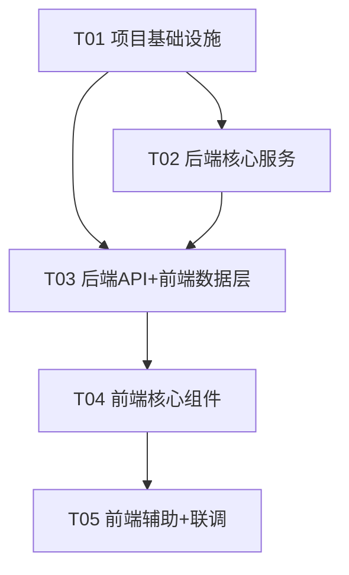

# DBClient MVP — 系统架构设计 + 任务分解

> 文档版本：v0.1 ｜ 角色：架构师（高见远）｜ 语言：中文
> 配套文件：`docs/class-diagram.mermaid`、`docs/sequence-diagram.mermaid`
> 落盘路径：`C:\Users\Administrator\myproject\dbclient-mvp`

---

## 1. 实现方案概述 + 框架选型

### 1.1 核心难点与选型

| 难点 | 选型 / 策略 | 理由 |
| --- | --- | --- |
| 多数据库驱动（MySQL + PG） | `mysql2/promise` + `pg` | 轻量、Promise 化、社区成熟 |
| 密码与 API Key 落盘安全 | Node 原生 `crypto`（AES-256-GCM），主密钥取自环境变量 | 零额外依赖、满足 P0-4 |
| AI 上下文脱敏 | 仅通过 `information_schema` 读取 DDL（表名/列名/类型/注释），**绝不发数据行** | 天然脱敏，满足主理人决策 #2 |
| AI 接口兼容 | OpenAI Chat Completions 协议（`POST /chat/completions`） | GPT / 通义 / Ollama 一致 |
| 前端 SQL 编辑体验 | `@uiw/react-codemirror` + `@codemirror/lang-sql` | 轻量、自带高亮、比 Monaco 体积小 |
| 状态管理 | `zustand` | 极简、少样板、适合单页工作流 |
| 结果集行数控制 | 后端默认对 SELECT 追加 `LIMIT 1000`，前端提供「取消限制」开关 | 满足主理人决策 #5，不做服务端分页 |
| 配置持久化 | 后端 JSON 文件（`server/data/*.json`） | 主理人决策 #3，单机单用户 |

### 1.2 后端语言选择（主理人要求明确）

**后端采用 TypeScript**（Node + Express + `tsx` 开发运行 + `tsc` 构建）。理由：API 契约清晰、前后端共享类型心智模型、减少字段拼写错误。前端同样 TS。

### 1.3 架构模式

- 后端：**分层架构** = 路由层（route）→ 服务层（service）→ 驱动/工具层。无 ORM，直接参数化 SQL，避免抽象过度。
- 前端：**组件化 + 轻量状态机**（zustand store 持有当前连接、查询结果、AI 结果）。
- 通信：前端 `/api` 前缀代理到后端（Vite dev proxy；生产由后端静态托管或同源部署）。

### 1.4 目录结构（完整）

```
dbclient-mvp/
├── package.json                 # 根：scripts 串联前后端（concurrently）
├── README.md
├── .gitignore                   # 忽略 node_modules / server/data/*.json / .env
├── docs/
│   ├── prd.md                   # (已存在) 产品需求
│   ├── architecture.md          # 本文档
│   ├── class-diagram.mermaid    # 类图
│   └── sequence-diagram.mermaid # 时序图
│
├── server/                      # ===== 后端 (Node + Express + TS) =====
│   ├── package.json
│   ├── tsconfig.json
│   ├── .env.example             # 示例环境变量（DB_CLIENT_MASTER_KEY / PORT）
│   ├── src/
│   │   ├── index.ts             # 入口：加载 env → 启动 app → 监听端口
│   │   ├── app.ts               # Express 实例：中间件 + 路由挂载 + 错误处理
│   │   ├── config/
│   │   │   └── env.ts           # 读取并校验环境变量（主密钥必填，否则启动失败）
│   │   ├── models/
│   │   │   └── types.ts         # 共享 TS 类型/接口（连接、查询、AI、响应）
│   │   ├── middleware/
│   │   │   └── errorHandler.ts  # 统一异常处理 → 统一响应结构
│   │   ├── utils/
│   │   │   └── response.ts      # ok() / fail() 统一响应构造器
│   │   ├── services/
│   │   │   ├── cryptoService.ts     # AES-256-GCM 加解密（见 §3.5）
│   │   │   ├── dbService.ts         # 建连 + 执行 SQL（mysql2 / pg）
│   │   │   ├── schemaService.ts     # information_schema 读取 DDL 上下文
│   │   │   ├── connectionService.ts # connections.json 增删改查
│   │   │   ├── settingsService.ts   # settings.json 增改（AI 配置）
│   │   │   ├── aiService.ts         # 调用 OpenAI 兼容接口生成 SQL
│   │   │   └── historyService.ts    # history.json 执行历史（P1）
│   │   └── routes/
│   │       ├── connections.ts   # P0-1 连接 CRUD + 测试
│   │       ├── query.ts          # P0-2 SQL 执行
│   │       ├── ai.ts             # P0-3 AI 生成 SQL
│   │       ├── settings.ts       # P1-3 AI 接口配置 + 测试
│   │       └── history.ts        # P1-1 历史记录
│   └── data/                    # 运行时生成（gitignored）
│       ├── connections.json
│       ├── settings.json
│       └── history.json
│
└── web/                         # ===== 前端 (Vite + React + MUI + Tailwind) =====
    ├── package.json
    ├── vite.config.ts           # 含 /api 代理到 http://localhost:4000
    ├── tailwind.config.js
    ├── postcss.config.js
    ├── tsconfig.json
    ├── index.html
    └── src/
        ├── main.tsx             # 挂载 React
        ├── App.tsx              # 路由 + 布局装配
        ├── index.css            # Tailwind 指令 + 全局样式
        ├── types/
        │   └── index.ts         # 前端类型（与后端 models 对齐）
        ├── api/
        │   └── client.ts        # fetch 封装（统一 baseURL=/api、错误处理）
        ├── store/
        │   └── appStore.ts      # zustand：当前连接、查询结果、AI 结果、历史
        ├── utils/
        │   └── csv.ts           # 结果集导出 CSV（P1-2）
        ├── components/
        │   ├── Layout.tsx           # 顶栏 + 左右分栏骨架
        │   ├── ConnectionManager.tsx# 连接列表 + 操作（测试/打开/删）
        │   ├── ConnectionForm.tsx   # 新建/编辑连接表单（含测试按钮）
        │   ├── SqlEditor.tsx        # CodeMirror SQL 编辑器 + 执行/清空
        │   ├── ResultTable.tsx      # 结果表格（排序 + 导出 CSV + 行数/耗时）
        │   ├── AiPanel.tsx          # 自然语言输入 → 生成 → 回填编辑器
        │   ├── SettingsDialog.tsx   # AI 接口配置（baseURL/Key/Model + 测试）
        │   └── HistoryPanel.tsx     # 执行历史列表（点击重载）
        └── pages/
            └── MainPage.tsx     # 三栏工作台装配（左连接/中编辑器/右AI）
```

---

## 2. 文件列表与相对路径

| 文件 | 层 | 说明 |
| --- | --- | --- |
| `server/package.json` | 后端 | 依赖与脚本（dev/build/start） |
| `server/tsconfig.json` | 后端 | TS 编译配置 |
| `server/.env.example` | 后端 | 环境变量示例 |
| `server/src/index.ts` | 后端 | 进程入口 |
| `server/src/app.ts` | 后端 | Express 装配 |
| `server/src/config/env.ts` | 后端 | 环境变量校验 |
| `server/src/models/types.ts` | 后端 | 共享类型 |
| `server/src/middleware/errorHandler.ts` | 后端 | 统一错误 → 响应 |
| `server/src/utils/response.ts` | 后端 | 统一响应构造 |
| `server/src/services/cryptoService.ts` | 后端 | AES-256-GCM |
| `server/src/services/dbService.ts` | 后端 | 执行 SQL |
| `server/src/services/schemaService.ts` | 后端 | DDL 上下文 |
| `server/src/services/connectionService.ts` | 后端 | 连接持久化 |
| `server/src/services/settingsService.ts` | 后端 | AI 配置持久化 |
| `server/src/services/aiService.ts` | 后端 | AI 生成 SQL |
| `server/src/services/historyService.ts` | 后端 | 历史持久化 |
| `server/src/routes/connections.ts` | 后端 | 连接 API |
| `server/src/routes/query.ts` | 后端 | 查询 API |
| `server/src/routes/ai.ts` | 后端 | AI API |
| `server/src/routes/settings.ts` | 后端 | 设置 API |
| `server/src/routes/history.ts` | 后端 | 历史 API |
| `web/package.json` | 前端 | 依赖与脚本 |
| `web/vite.config.ts` | 前端 | 构建 + 代理 |
| `web/tailwind.config.js` | 前端 | Tailwind |
| `web/postcss.config.js` | 前端 | PostCSS |
| `web/tsconfig.json` | 前端 | TS 配置 |
| `web/index.html` | 前端 | HTML 入口 |
| `web/src/main.tsx` | 前端 | React 挂载 |
| `web/src/App.tsx` | 前端 | 路由装配 |
| `web/src/index.css` | 前端 | 全局样式 |
| `web/src/types/index.ts` | 前端 | 前端类型 |
| `web/src/api/client.ts` | 前端 | API 封装 |
| `web/src/store/appStore.ts` | 前端 | 状态管理 |
| `web/src/utils/csv.ts` | 前端 | CSV 导出 |
| `web/src/components/Layout.tsx` | 前端 | 布局骨架 |
| `web/src/components/ConnectionManager.tsx` | 前端 | 连接列表 |
| `web/src/components/ConnectionForm.tsx` | 前端 | 连接表单 |
| `web/src/components/SqlEditor.tsx` | 前端 | SQL 编辑器 |
| `web/src/components/ResultTable.tsx` | 前端 | 结果表 |
| `web/src/components/AiPanel.tsx` | 前端 | AI 面板 |
| `web/src/components/SettingsDialog.tsx` | 前端 | AI 配置弹窗 |
| `web/src/components/HistoryPanel.tsx` | 前端 | 历史面板 |
| `web/src/pages/MainPage.tsx` | 前端 | 工作台页 |

---

## 3. 数据结构和接口

### 3.1 核心类型（`server/src/models/types.ts`）

```typescript
export type DbType = 'mysql' | 'postgres';

export interface ConnectionInput {
  name: string;
  type: DbType;
  host: string;
  port: number;
  database: string;
  username: string;
  password: string;          // 明文（来自请求体，HTTPS/localhost 内网）
}

export interface ConnectionRecord {
  id: string;                // nanoid
  name: string;
  type: DbType;
  host: string;
  port: number;
  database: string;
  username: string;
  passwordEnc: string;       // AES-256-GCM 密文（base64）
  createdAt: string;         // ISO8601
  updatedAt: string;
}

// 返回给前端时剔除密码字段
export type ConnectionPublic = Omit<ConnectionRecord, 'passwordEnc'>;

export interface ConnectionTestReq extends ConnectionInput {}
export interface ConnectionTestRes {
  ok: boolean;
  message: string;
  latencyMs: number | null;
}

export interface AiSettingsInput {
  baseUrl: string;           // 如 https://api.openai.com/v1
  apiKey: string;            // 明文，落盘加密
  model: string;             // 如 gpt-4o / qwen-plus / ollama/llama3
  enabled: boolean;
}
export interface AiSettingsRecord {
  baseUrl: string;
  apiKeyEnc: string;        // 密文
  model: string;
  enabled: boolean;
  updatedAt: string;
}
export type AiSettingsPublic = Omit<AiSettingsRecord, 'apiKeyEnc'> & { hasKey: boolean };

export interface QueryExecReq {
  connectionId: string;
  sql: string;              // 整段或选中文本
  limit: boolean;           // 默认 true（追加 LIMIT 1000）
  limitValue?: number;      // 默认 1000
  unlimited?: boolean;      // true 时忽略 limit（「取消限制」开关）
}
export interface QueryResult {
  columns: string[];
  rows: Record<string, unknown>[];
  rowCount: number;
  elapsedMs: number;
  truncated: boolean;       // 命中 LIMIT 时为 true
  appliedLimit: number | null;
}
export interface AiGenerateReq {
  connectionId: string;
  prompt: string;
}
export interface AiGenerateRes {
  statements: string[];     // 清洗拆分后的多条 SQL（已去围栏/解释，空段已剔除）
  model: string;
}
// 多语句执行（POST /api/query/execute-multi）
export interface MultiExecReq {
  connectionId: string;
  sql: string;              // 可能含多条语句，服务端按 ; 拆分
  limit?: boolean;          // 默认 true（每条 SELECT 各自追加 LIMIT 1000）
  limitValue?: number;
  unlimited?: boolean;
}
export interface MultiExecStatement {
  sql: string;
  result?: QueryResult;     // 成功：单条结果
  error?: string;           // 失败：业务错误信息（无凭据/密文）
}
export interface MultiExecResult {
  statements: MultiExecStatement[];
  successCount: number;
  errorCount: number;
}
export interface HistoryItem {
  id: string;
  connectionId: string;
  connectionName: string;
  sql: string;
  status: 'success' | 'error';
  rowCount: number | null;
  elapsedMs: number | null;
  error: string | null;
  executedAt: string;
}
export interface ApiResponse<T> {
  code: number;
  data: T | null;
  message: string;
}
```

### 3.2 统一响应结构（共享约定）

```jsonc
// 成功
{ "code": 0, "data": { ... }, "message": "ok" }
// 失败
{ "code": 50002, "data": null, "message": "SQL 执行失败: ..." }
```

错误码表（详见 §7）。所有路由返回 `ApiResponse<T>`，由 `utils/response.ts` 的 `ok(res,data)` / `fail(res,code,msg)` 与 `errorHandler` 中间件统一产出。

### 3.3 加密模块约定（共享，`cryptoService.ts`）

```typescript
// 主密钥：env.DB_CLIENT_MASTER_KEY（缺失则启动时抛错退出）
// 32 字节密钥派生：sha256(masterKey)
encrypt(plain: string): string   // 返回 base64( iv[12] + authTag[16] + ciphertext )
decrypt(token: string): string   // 还原明文；失败抛 EncryptionError
```

- 存储格式单一字符串，无需额外字段。
- 所有密码/Key 落盘前必须 `encrypt`，读取后 `decrypt`，**日志与列表接口绝不出现明文/密文**。

### 3.4 REST API 端点列表

> 基础前缀：`/api`。所有请求 `Content-Type: application/json`。

#### 连接（P0-1 / P0-4）

| 方法 | 路径 | 请求体 | 响应 `data` |
| --- | --- | --- | --- |
| GET | `/api/connections` | — | `ConnectionPublic[]` |
| GET | `/api/connections/:id` | — | `ConnectionPublic` |
| POST | `/api/connections` | `ConnectionInput` | `ConnectionPublic` |
| PUT | `/api/connections/:id` | `ConnectionInput` | `ConnectionPublic` |
| DELETE | `/api/connections/:id` | — | `{ id: string }` |
| POST | `/api/connections/test` | `ConnectionInput` | `ConnectionTestRes` |

- 创建/编辑时 `password` 明文入参 → 服务层 `encrypt` 后存 `passwordEnc`；响应不回传密码字段。

#### 查询执行（P0-2）

| 方法 | 路径 | 请求体 | 响应 `data` |
| --- | --- | --- | --- |
| POST | `/api/query/execute` | `QueryExecReq` | `QueryResult` |

- 后端逻辑：按 `connectionId` 取连接 → `decrypt` 密码 → 建连 → 若 `unlimited!==true && limit!==false` 且为单行 SELECT 且不含 `LIMIT`，则追加 `LIMIT {limitValue||1000}`（标记 `truncated=true`、`appliedLimit`）；执行并计时；返回列/行/行数/耗时。

#### AI 生成 SQL（P0-3 / P0-5）

| 方法 | 路径 | 请求体 | 响应 `data` |
| --- | --- | --- | --- |
| POST | `/api/ai/generate` | `AiGenerateReq` | `AiGenerateRes` |
| POST | `/api/query/execute-multi` | `MultiExecReq` | `MultiExecResult` |

- 后端逻辑：取连接 → `schemaService` 拉 DDL（仅结构）→ `aiService` 组装 prompt（系统提示 + DDL 上下文 + 用户需求）→ 调 OpenAI 兼容 `/chat/completions` → 解析去除 ```sql 围栏 → 返回 `sql`。**仅返回，绝不自动执行**（满足 P0-5）。

#### AI 接口配置（P1-3）

| 方法 | 路径 | 请求体 | 响应 `data` |
| --- | --- | --- | --- |
| GET | `/api/settings/ai` | — | `AiSettingsPublic` |
| PUT | `/api/settings/ai` | `AiSettingsInput` | `AiSettingsPublic` |
| POST | `/api/settings/ai/test` | `AiSettingsInput` | `{ ok: boolean, message: string }` |

- Key 明文入参 → `encrypt` 存 `apiKeyEnc`；GET 返回 `hasKey` 布尔，不回传密文。

#### 执行历史（P1-1）

| 方法 | 路径 | 请求体 | 响应 `data` |
| --- | --- | --- | --- |
| GET | `/api/history?connectionId=&limit=50` | query | `HistoryItem[]`（倒序） |
| DELETE | `/api/history/:id` | — | `{ id: string }` |
| DELETE | `/api/history` | — | `{ deleted: number }`（清空） |

### 3.5 类图（见 `docs/class-diagram.mermaid`）

关键类：`ConnectionRecord` / `AiSettingsRecord` / `QueryResult` / `CryptoService` / `DbService` / `SchemaService` / `ConnectionService` / `SettingsService` / `AiService` / `HistoryService` / 各 `Route` 处理器。关系：`*Service` 依赖 `CryptoService`；`AiService` 依赖 `SchemaService`；`Route` 依赖对应 `Service`。

---

## 4. 程序调用流程（时序图，见 `docs/sequence-diagram.mermaid`）

包含三条核心时序：
1. **测试 / 建立连接**：前端 → `POST /api/connections/test` → ConnectionRoute → ConnectionService(encrypt 测试用密码，不入文件) → DbService(建连+执行 `SELECT 1`) → 返回 `ConnectionTestRes`。
2. **执行 SQL**：前端（编辑器选中/整段 + 限制开关）→ `POST /api/query/execute` → QueryRoute → ConnectionService 取连接 → CryptoService.decrypt → DbService 执行（按需追加 LIMIT）→ 返回 `QueryResult`；同时 HistoryService 记一条。
3. **AI 生成 SQL**：前端（自然语言）→ `POST /api/ai/generate` → AiRoute → SchemaService(读 information_schema DDL) → AiService(组装 prompt → OpenAI 兼容接口) → 返回 `AiGenerateRes.sql`；前端点击「回填编辑器」仅写入编辑器，**不**调用执行（P0-5）。

---

## 5. 任务列表（有序、含依赖，按实现顺序）

> 硬约束：≤5 个任务；首任务为项目基础设施；每个任务 ≥3 个文件；尽量扁平依赖。

| 任务 | 名称 | 源文件 | 依赖 | 优先级 | 产出 |
| --- | --- | --- | --- | --- | --- |
| **T01** | 项目基础设施（前后端脚手架 + 配置 + 入口） | `server/package.json`, `server/tsconfig.json`, `server/.env.example`, `server/src/index.ts`, `server/src/app.ts`, `server/src/models/types.ts`, `web/package.json`, `web/vite.config.ts`, `web/tailwind.config.js`, `web/postcss.config.js`, `web/tsconfig.json`, `web/index.html`, `web/src/main.tsx`, `web/src/App.tsx`, `web/src/index.css`, `package.json`(root) | — | P0 | 可 `npm install` 并分别 `npm run dev` 启动空后端/空前端的环境 |
| **T02** | 后端核心服务（加密 + 驱动 + 连接持久化 + 统一响应） | `server/src/config/env.ts`, `server/src/utils/response.ts`, `server/src/middleware/errorHandler.ts`, `server/src/services/cryptoService.ts`, `server/src/services/dbService.ts`, `server/src/services/schemaService.ts`, `server/src/services/connectionService.ts` | T01 | P0 | 加密可用、两库驱动可执行参数化 SQL、连接 JSON 增删改查、统一响应与错误码生效 |
| **T03** | 后端 API 路由 + AI/历史服务 + 前端数据层 | `server/src/routes/connections.ts`, `server/src/routes/query.ts`, `server/src/routes/ai.ts`, `server/src/routes/settings.ts`, `server/src/routes/history.ts`, `server/src/services/aiService.ts`, `server/src/services/settingsService.ts`, `server/src/services/historyService.ts`, `web/src/types/index.ts`, `web/src/api/client.ts`, `web/src/store/appStore.ts` | T01, T02 | P0 | 全部 REST 端点可用；前端 API 封装与 zustand store 就绪 |
| **T04** | 前端核心组件（连接管理 + 编辑器 + 结果表 + AI 面板 + 工作台） | `web/src/components/Layout.tsx`, `web/src/components/ConnectionManager.tsx`, `web/src/components/ConnectionForm.tsx`, `web/src/components/SqlEditor.tsx`, `web/src/components/ResultTable.tsx`, `web/src/components/AiPanel.tsx`, `web/src/pages/MainPage.tsx` | T03 | P0 | P0-1~P0-5 完整可用：管理连接、执行 SQL、AI 生成并回填、密码加密存储 |
| **T05** | 前端辅助（AI 配置页 + 历史面板 + 导出 CSV + 集成联调） | `web/src/components/SettingsDialog.tsx`, `web/src/components/HistoryPanel.tsx`, `web/src/utils/csv.ts`, `web/src/App.tsx`(路由装配) | T04 | P1 | P1-1~P1-5 完成：配置页+连通测试、历史、结果排序/导出、LIMIT 1000、友好错误处理 |

依赖关系图（mermaid）：


---

## 6. 依赖包列表

### 后端 `server/package.json`
| 包 | 版本 | 用途 |
| --- | --- | --- |
| `express` | ^4.19.2 | Web 框架、路由 |
| `cors` | ^2.8.5 | 跨域（dev 前端独立端口） |
| `dotenv` | ^16.4.5 | 加载 `.env` |
| `mysql2` | ^3.9.7 | MySQL 驱动（promise） |
| `pg` | ^8.12.0 | PostgreSQL 驱动 |
| `nanoid` | ^5.0.7 | 生成连接/历史 ID |
| `zod` | ^3.23.8 | 请求体校验 |
| `typescript` | ^5.4.5 | 编译（dev） |
| `tsx` | ^4.16.2 | 开发直接跑 TS |
| `@types/express` | ^4.17.21 | 类型 |
| `@types/cors` | ^2.8.17 | 类型 |
| `@types/node` | ^20.14.0 | 类型 |
| `@types/pg` | ^8.11.6 | 类型 |

### 前端 `web/package.json`
| 包 | 版本 | 用途 |
| --- | --- | --- |
| `react` | ^18.3.1 | UI 框架 |
| `react-dom` | ^18.3.1 | DOM 渲染 |
| `@mui/material` | ^5.15.20 | 组件库 |
| `@mui/icons-material` | ^5.15.20 | 图标 |
| `@emotion/react` | ^11.11.4 | MUI 样式引擎 |
| `@emotion/styled` | ^11.11.5 | MUI 样式 |
| `tailwindcss` | ^3.4.4 | 原子化样式 |
| `postcss` | ^8.4.38 | Tailwind 构建 |
| `autoprefixer` | ^10.4.19 | 浏览器前缀 |
| `@uiw/react-codemirror` | ^4.22.0 | SQL 编辑器 |
| `@codemirror/lang-sql` | ^6.7.0 | SQL 语言包 |
| `axios` | ^1.7.2 | HTTP 封装（或自建 fetch） |
| `zustand` | ^4.5.2 | 状态管理 |
| `vite` | ^5.3.1 | 构建/ dev server |
| `@vitejs/plugin-react` | ^4.3.1 | React 插件 |
| `typescript` | ^5.4.5 | 编译 |

### 根 `package.json`
| 脚本 | 命令 | 用途 |
| --- | --- | --- |
| `dev` | `concurrently "npm:dev:server" "npm:dev:web"` | 同时起前后端（需 `concurrently` devDep） |
| `dev:server` | `cd server && npm run dev` | 后端 tsx watch |
| `dev:web` | `cd web && npm run dev` | 前端 vite |
| `build` | `cd server && npm run build && cd ../web && npm run build` | 生产构建 |

---

## 7. 共享知识（跨文件约定）

- **统一响应**：所有接口返回 `{code,data,message}`，`code=0` 成功。见 §3.2。
- **错误码表**：

  | code | 含义 | 触发场景 |
  | --- | --- | --- |
  | 0 | 成功 | — |
  | 40001 | 请求参数校验失败 | zod 校验不过 |
  | 40101 | 加密/解密失败 / 主密钥缺失 | `DB_CLIENT_MASTER_KEY` 未设或解密失败 |
  | 40401 | 资源不存在 | 连接/历史 ID 未找到 |
  | 40901 | 连接名冲突 | 同名连接已存在 |
  | 50001 | 数据库连接/建连失败 | 主机不可达、账号错 |
  | 50002 | SQL 执行失败 | 语法/权限错误 |
  | 50003 | AI 服务调用失败 | 接口 4xx/5xx、超时、解析失败 |
  | 50004 | 内部错误 | 未捕获异常（errorHandler 兜底） |

- **加密调用方式**：仅 `cryptoService.encrypt/decrypt` 接触密钥；调用方（connectionService/settingsService）在持久化前加密、读取后解密；**日志与任何 List/GET 响应不得包含 `passwordEnc` / `apiKeyEnc`**。
- **AI Prompt 模板约定**：
  ```
  system: 你是资深 SQL 工程师。下面是被查询数据库的表结构（DDL，仅含表名/列名/类型/注释，不含任何数据行）。
          请根据用户需求生成【一条】可执行的 SQL。只输出 SQL 本身，不要解释，不要使用 markdown 代码块围栏。
  user:   <DDL 上下文>

          需求：<用户自然语言>
  ```
  - DDL 上下文由 `schemaService` 从 `information_schema` 生成（MySQL 与 PG 各自适配），**仅结构，无数据行**。
  - 解析时若模型返回 ```sql ... ``` 围栏，需剥离围栏与语言标识，仅保留 SQL 文本。
  - 模型与超时（建议 30s）来自 `settings.json`；超时按 50003 处理。
- **LIMIT 约定**：`query.execute` 默认对单行 SELECT 且无已有 `LIMIT` 时追加 `LIMIT 1000`；前端「取消限制」开关置 `unlimited=true` 时跳过；不做服务端分页（决策 #5）。
- **存储文件**：`server/data/{connections,settings,history}.json`，运行时若不存在则由服务层创建空数组/对象；均 gitignored。
- **运行前提**：后端启动必须存在 `DB_CLIENT_MASTER_KEY`（建议 ≥16 位随机串），否则 `env.ts` 抛错退出。`.env.example` 提供模板。

---

## 8. 待明确事项（Unclear）

1. **结果集 LIMIT 的边界处理**：当前对含 `UNION` / 子查询 / 已有 `LIMIT` 的 SQL 仅做简单判断（单行 SELECT 且无 LIMIT 才追加）。复杂 SQL 的 LIMIT 注入（包裹子查询 vs 直接追加）留待工程师按 PG/MySQL 语法细化，文档已标注为简化策略。
2. **AI 生成 SQL 的语句类型范围**：MVP 允许 AI 生成 SELECT 之外的语句（如带条件的 UPDATE 片段），但**一律仅建议、不自动执行**（P0-5）。是否在 UI 上对写操作额外二次确认弹窗，建议 T04 实现时加轻量确认，非阻塞。
3. **history.json 容量**：建议上限 200 条环形覆盖，未强制；T05 实现时可由 `historyService` 维护。
4. **前端部署形态**：生产环境是否由 Express 静态托管 `web/dist` 同源部署（单一端口）待定；MVP dev 用 Vite proxy 已满足，同源部署在 `app.ts` 预留静态目录挂载点即可。
5. **多语句执行**：已支持（新增 `POST /api/query/execute-multi`，服务端 `splitStatements` 按 `;` 拆多条、逐条独立执行、错误隔离、每条 SELECT 各自追加 LIMIT；前端 AI 面板逐条展示并支持单条/全部执行）。多语句分标签展示（P2-1）仍可选。

---

> 文档结束。工程师可依据 §3 接口与 §5 任务顺序直接实现；mermaid 图见配套文件。
