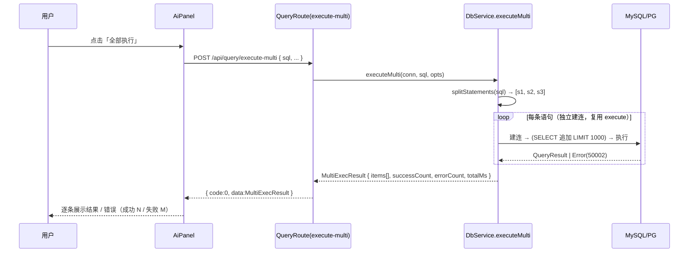

# DBClient MVP — 增量迭代 PRD：AI 生成 SQL 清洗 + 多语句执行（简单 PRD）

> 迭代功能名：**AI 生成 SQL 清洗 + 多语句执行**
> 文档版本：v0.2 ｜ 角色：产品经理（许清楚）｜ 语言：中文
> 配套基线：`docs/prd.md`（v0.1）、`docs/architecture.md`（v0.1）
> 落盘路径：`C:\Users\Administrator\myproject\dbclient-mvp`

---

## 0. 现状确认（基于代码事实，非凭空描述）

本迭代是把 `docs/architecture.md` §8.5「多语句执行（P2-1）不在 MVP 范围」提升为本次范围。以下为已核对的代码现状：

| 现状点 | 代码事实 | 来源 |
| --- | --- | --- |
| AI 返回被整体当**一条** SQL | `generate()` 返回 `AiGenerateRes { sql: string; model: string }`，仅用 `stripFences()` 剥掉 ```sql 围栏 | `server/src/services/aiService.ts:11, 104`；`server/src/models/types.ts` / `web/src/types/index.ts:79-82` |
| 系统提示词强制单条 | `SYSTEM_PROMPT`：「生成【一条】可执行的 SQL。只输出 SQL 本身，不要解释，不要使用 markdown 代码块围栏。」 | `server/src/services/aiService.ts:15-16`；`docs/architecture.md` §7 |
| 前端把 `sql` 直接填入编辑器 | `appStore.ts` 的 `aiResult: string` 由 `res.sql` 赋值；`AiPanel.tsx` 的「回填编辑器」直接 `setSql(aiResult)` | `web/src/store/appStore.ts:37,159`；`web/src/components/AiPanel.tsx:25,39,115` |
| 执行链路只支持单条 | `mysqlConfig` 设 `multipleStatements: false`；`shouldApplyLimit()` 遇含 `;` 的 SQL 直接 `return false`；PG `client.query` 同样只跑一条 | `server/src/services/dbService.ts:40, 91, 201` |
| 单条接口保留 | `POST /api/query/execute` 由 `query.ts` 处理，左侧表树点表名仍走它 | `server/src/routes/query.ts` |
| 多语句为 P2-1 | `docs/architecture.md` §8.5：「多语句分标签展示为 P2-1，不在本次范围」——本次即提升 | `docs/architecture.md:464` |

结论：本次迭代做两件事 —— **(1) AI 输出稳健清洗**，**(2) 多语句执行**。

---

## 1. 项目信息

| 项 | 内容 |
| --- | --- |
| Language | 中文 |
| 前端技术栈 | Vite + React + MUI + Tailwind + CodeMirror + zustand（**不变**） |
| 后端技术栈 | Node + Express + TypeScript(ESM)，mysql2 / pg 驱动，无 ORM（**不变**） |
| 形态 | Web 应用，浏览器访问（**不变**） |
| 数据库支持 | MySQL、PostgreSQL（**不变**） |
| 本次范围 | AI 生成结果清洗（多语句拆分）+ 新增多语句执行接口与面板交互 |
| Project Name | `dbclient_mvp`（**不变**） |

---

## 2. 产品目标（Product Goals）

1. **稳健消化模型噪声（正交于「生成能力」）**：让 AI 面板对「混杂 markdown 围栏 / 解释性文字 / SQL 注释 / 多条 SQL」的模型返回具备稳健清洗能力，按 `;` 拆分为多条语句（且拆分必须尊重字符串字面量与注释），把不可控的模型输出收敛为结构化的 `statements: string[]`。
2. **补齐多语句执行能力（正交于「单条执行」）**：在保留原单条 `POST /api/query/execute`（左侧表树点表名仍用它）的前提下，新增 `POST /api/query/execute-multi`，支持一段可能含多条语句的 SQL 逐条独立执行、各自按需追加 LIMIT、汇总「每条结果或错误」返回，前端逐条列出并支持单条/全部执行与回填。
3. **守住安全与一致约束（正交于「新功能」）**：AI 生成结果仍**只建议、不自动执行**（原 P0-5）；密码 / API Key 仍走 AES-256-GCM、日志与 List/GET 绝不出现明文或密文；统一响应结构与既有错误码全部沿用。

---

## 3. 用户故事（User Stories）

1. **作为不熟悉 SQL 的业务同学**，我希望在 AI 面板描述一句复杂需求（如「统计近 7 天新增用户数，并把活跃用户标记为 1」），模型即便返回带解释文字和三条 SQL，系统也能自动拆好、逐条列出，以便我逐条核对后再执行。
2. **作为后端开发**，我希望 AI 生成的多条 SQL 在面板里逐条展示，并能「单条执行」先验证一条、「全部执行」一次性跑完，以便安全地完成多步数据操作。
3. **作为数据分析师**，我希望多条 SELECT 各自独立返回结果表格（每条命中 LIMIT 时标注截断），以便我快速对比多步取数结果。
4. **作为安全负责人**，我希望 AI 生成的写操作（INSERT/UPDATE/DELETE/DDL）在执行前有明确确认，且 AI 结果绝不自动执行，以便降低误执行风险（延续 P0-5）。
5. **作为运维**，我希望即便模型偶尔只返回解释文字、未给 SQL，系统也给出友好提示而非崩溃，以便我据此调整需求重试。

---

## 4. 需求池（Requirements Pool）

> 优先级：P0 = 必须（本次上线门槛）｜ P1 = 重要（强烈建议本迭代包含）｜ P2 = 可选（后续迭代）

### P0 — 必须

**P0-1 AI 输出稳健清洗（替换 `stripFences`）**
- 描述：在 `aiService.ts` 新增 `cleanAndSplit(text): string[]`，替换现有仅做围栏剥离的 `stripFences()`。流程：
  1. 剥离 ```sql … ``` 与 ``` … ``` 围栏（保留内部，可能含多条）；
  2. 去除首尾解释性文字（SQL 之外的说明性语言），保留 SQL 内合法注释（`--` / `/* */`）；
  3. 按 `;` 拆分为多条语句，拆分时维护状态机：**处于单引号 `'…'` / 双引号 `"…"` 字符串字面量内、或 `--` 行注释至行末、`/* … */` 块注释内时，不拆分**；正确识别转义引号 `\'` 与 `""`；
  4. 去每条首尾空白，**剔除仅空白 / 仅注释的空语句**；
  5. 返回 `statements: string[]`。
- 验收标准：
  - `'SELECT 1; SELECT \'a;b\''` → 拆为 2 条，第二条为 `SELECT 'a;b'`（不被字面量内 `;` 误拆）；
  - `"UPDATE t SET c='x;y'"` 内 `;` 不拆；
  - 含 `/* c; d */` 块注释的 `;` 不拆；
  - 模型返回「这里给你两条 SQL：\n```sql\nSELECT 1;\nSELECT 2;\n```\n希望对你有帮助」→ 返回 `['SELECT 1','SELECT 2']`，解释文字被剥离；
  - 更新 `AiGenerateRes` 类型（前后端 `types` 对齐）为含 `statements: string[]`；`generate()` 返回 `statements` 而非 `sql`。
- 关联代码：`server/src/services/aiService.ts:19-25,104`、`server/src/models/types.ts`、`web/src/types/index.ts:79-82`。

**P0-2 系统提示词改造**
- 描述：将 `SYSTEM_PROMPT` 由「生成【一条】… 不要解释、不要围栏」改为「允许生成【多条】，以 `;` 分隔；可含 SQL 内 `--` 注释，但不要在 SQL 之外写解释性文字、不要使用 markdown 代码块围栏」。
- 验收标准：模型在 DDL 上下文 + 需求下生成的多条 SQL 以 `;` 分隔、无外围解释文字、无围栏；原 DDL 上下文（仅结构、无数据行）机制不变。
- 关联代码：`server/src/services/aiService.ts:15-16`、`docs/architecture.md` §7。

**P0-3 多语句执行后端（新增 `execute-multi`）**
- 描述：新增 `POST /api/query/execute-multi`。服务端**复用同一 `splitStatements`（即 P0-1 的清洗/拆分逻辑）**拆分入参 `sql` → 逐条**独立建连/执行**（每条复用现有 `execute()`，即短生命周期连接，与现有架构一致）；每条 SELECT 各自按需追加 `LIMIT {limitValue||1000}`（前端 `unlimited=true` 时跳过）；汇总为 `MultiExecResult` 返回。
- 请求体：`{ connectionId: string; sql: string; limit?: boolean; limitValue?: number; unlimited?: boolean }`（与 `execute` 同形，额外可选 `transaction` 见 P2-2）。
- 响应 `data`（`MultiExecResult`）：
  ```typescript
  interface StatementResult {
    index: number;            // 第几条（从 1 起）
    sql: string;              // 该条清洗后原文
    status: 'success' | 'error';
    result?: QueryResult;     // 成功：单条结果（列/行/行数/耗时/truncated/appliedLimit）
    error?: string;           // 失败：业务错误信息（不含凭据/密文）
    elapsedMs: number;
  }
  interface MultiExecResult {
    items: StatementResult[];
    totalMs: number;
    successCount: number;
    errorCount: number;
  }
  ```
- 验收标准：
  - 多条 SELECT 各自返回结果，各自独立标记 `truncated` / `appliedLimit`；
  - 其中任一条失败（50002）**不阻断其余语句**执行，整体 `code=0`（聚合成功），失败条 `status:'error'` 带 `error`；
  - 入参为空 / `connectionId` 缺失 → `40001`；连接不存在 → `40401`；
  - **原 `POST /api/query/execute` 单条接口完全不变**（左侧表树点表名仍走它）。
- 关联代码：`server/src/routes/query.ts`、`server/src/services/dbService.ts`、`server/src/services/connectionService.ts`。

**P0-4 前端 AI 面板多语句交互**
- 描述：AI 面板把 `statements: string[]` 逐条列表展示，每条提供「单条执行 / 回填编辑器 / 复制」；底部提供「全部执行 / 复制全部 / 回填编辑器（join 后写入，不执行）」。交互：
  - **单条执行**：对该条调用原 `POST /api/query/execute`（复用单条能力）；
  - **全部执行**：把 `statements.join(';\n')` 作为 `sql` 调用 `POST /api/query/execute-multi`；
  - **回填编辑器**：`setSql(statements.join(';\n'))`，**绝不自动执行**（延续 P0-5）；
  - 每条结果区展示成功/失败状态、行数、耗时；失败展示 `error` 文案。
- 验收标准：
  - AI 返回后页面**不会自动运行**任何 SQL（P0-5 强约束）；
  - 「全部执行」必须由用户主动点击触发；
  - 多语句列表与后端 `execute-multi` 的 `items` 一一对应展示。
- 关联代码：`web/src/components/AiPanel.tsx`、`web/src/store/appStore.ts`（新增 `aiStatements: string[]` 与 `runMultiQuery` 动作）、`web/src/api/client.ts`（新增 `executeMulti`）。

### P1 — 重要

**P1-1 写操作二次确认**
- 描述：在「单条执行 / 全部执行」触发到 INSERT / UPDATE / DELETE / DDL 等写语句时，前端弹窗二次确认（基于 `docs/architecture.md` §8.2 既有建议）；可勾选「本次不再提示」（会话级）。
- 验收标准：写语句执行前出现明确确认；SELECT 不触发；确认文案包含受影响连接名。
- 关联：`docs/architecture.md` §8.2。

**P1-2 错误与边界提示**
- 描述：模型仅返回解释文字、无 SQL 时，`generate()` 返回友好提示（沿用 50003 文案，如「AI 未返回有效 SQL，请调整需求后重试」），前端在面板展示并引导重试；清洗后空语句已在 P0-1 忽略。
- 验收标准：纯解释无 SQL → 面板给出非崩溃、可操作的提示；不抛出未捕获异常。

**P1-3 多语句结果展示策略**
- 描述：多语句结果支持逐条展开/折叠；前端在列表头展示「成功 N / 失败 M」计数；单条 SELECT 命中 LIMIT 1000 时沿用 `truncated` 标记与截断提示；整体结果体积给出上限保护（见待确认问题 3）。
- 验收标准：成功/失败计数正确；截断标记可见；长结果不卡死前端。

**P1-4 接口契约文档同步**
- 描述：更新 `docs/architecture.md` §3.1（类型：`AiGenerateRes`、`MultiExecResult`、`StatementResult`）、§3.4（新增 `POST /api/query/execute-multi` 端点表与错误码映射 50002/50003/40001/40401）、§8.5（将多语句执行从「待明确」改为「已实现」）。
- 验收标准：架构文档与代码契约一致。

### P2 — 可选

**P2-1 多语句结果多标签展示**：每条语句结果以独立 Tab / 分页呈现（原 P2-2「多标签分别展示」延续）。

**P2-2 事务选项**：`execute-multi` 增加可选 `transaction=true`，在同一持久连接内 `BEGIN/COMMIT` 实现「全成功或全回滚」（默认 `false` 各自独立，见待确认问题 2）。

**P2-3 AI 生成后「一键格式化 / 美化」多条语句**：基于现有编辑器格式化能力扩展到多语句。

**P2-4 历史记录对多语句的聚合**：`history.json` 保存整段 SQL 与逐条摘要（成功/失败计数），点击重载回编辑器。

---

## 5. UI 设计稿（文字描述 + ASCII / Mermaid 草图）

### 5.1 AI 面板（迭代后，`/workbench` 右侧）— ASCII 草图

```
┌──────────────────────────────────────────────────────────┐
│  AI 助手（自然语言生成 SQL）                              │
│  ┌────────────────────────────────────────────────────┐  │
│  │ 描述需求…（如：统计近7天新增用户，并标记活跃用户）   │  │
│  └────────────────────────────────────────────────────┘  │
│  [发送]                                                    │
├──────────────────────────────────────────────────────────┤
│  生成结果 · 共 3 条语句                                    │
│  ┌─ 语句 1 ───────────────────────────────────────────┐  │
│  │ SELECT COUNT(*) FROM users                          │  │
│  │   WHERE created_at > DATE_SUB(NOW(),7);              │  │
│  │ [单条执行][回填编辑器][复制]                          │  │
│  │ ✓ 1 行 · 23ms                                        │  │
│  └────────────────────────────────────────────────────┘  │
│  ┌─ 语句 2 ───────────────────────────────────────────┐  │
│  │ UPDATE users SET active=1                           │  │
│  │   WHERE last_login > DATE_SUB(NOW(),1);              │  │
│  │ [单条执行][回填编辑器][复制]                          │  │
│  │ ✗ SQL 执行失败: ... (50002)   ← 不阻断其余           │  │
│  └────────────────────────────────────────────────────┘  │
│  ┌─ 语句 3 ───────────────────────────────────────────┐  │
│  │ SELECT * FROM users WHERE active=1 LIMIT 100;        │  │
│  │ [单条执行][回填编辑器][复制]                          │  │
│  │ ✓ 100 行 · 12ms (LIMIT 命中)                         │  │
│  └────────────────────────────────────────────────────┘  │
│  [全部执行]  [复制全部]  [回填编辑器]                     │
│  ℹ AI 生成 SQL 仅作建议，需主动点击「执行」才真正运行    │
└──────────────────────────────────────────────────────────┘
```
组件说明：
- 列表区为 `statements` 的逐条卡片，每张卡片含语句预览 + 三个动作（单条执行 / 回填编辑器 / 复制）+ 结果/错误区。
- 底部「全部执行 / 复制全部 / 回填编辑器」作用于整段。
- 顶部「共 N 条语句」由 `statements.length` 得出；写语句卡片在「单条执行 / 全部执行」时触发 P1-1 确认弹窗。

### 5.2 多语句执行时序（Mermaid）— `execute-multi`



---

## 6. 约束（非功能 / 一致性，务必遵循）

- **技术栈不变**：后端 Node + Express + TypeScript(ESM)、mysql2/pg 驱动、无 ORM；前端 Vite + React + MUI + Tailwind + CodeMirror + zustand。
- **统一响应结构**：所有接口返回 `{ code, data, message }`，`code=0` 成功；`execute-multi` 整体成功聚合为 `code=0`，单条失败体现在 `items[].status`，不上升至顶层错误码（除非入参/连接级错误用 40001/40401/50001）。
- **错误码沿用**：SQL 执行失败 50002、AI 失败 50003、参数校验 40001、资源不存在 40401、建连失败 50001、加密失败 40101、内部错误 50004。
- **安全不降级**：密码 / API Key 仍走 AES-256-GCM（`cryptoService`）；日志与任何 List/GET 响应绝不出现明文或密文；`MultiExecResult` 的 `error` 字段仅含业务错误信息，不含凭据。
- **AI 仅建议、不自动执行**（原 P0-5）：无论单条还是全部执行，必须由用户主动点击触发；AI 生成后绝不自动运行。
- **LIMIT 策略保持**：每条 SELECT 各自按需追加 `LIMIT 1000`；前端「取消限制」开关置 `unlimited=true` 时跳过；不做服务端分页（与 `docs/architecture.md` §7 一致）。
- **单条接口保留**：原 `POST /api/query/execute` 及其 `multipleStatements:false` 行为不变，左侧表树点表名仍用它。

---

## 7. 待确认问题（Open Questions）

1. **写操作二次确认范围**：是所有写语句（INSERT/UPDATE/DELETE/DDL）一律弹窗，还是仅 DDL / 批量 DELETE 等高风险语句？是否提供「本次会话不再提示」勾选？（关联 P1-1）
2. **多语句是否要事务**：默认各自独立（全有全无否）。是否提供可选事务模式 `transaction=true`（P2-2，同一连接 BEGIN/COMMIT）？事务下的超时与长事务风险如何界定？
3. **超长结果集处理**：单条 SELECT 命中 LIMIT 1000 后，前端如何呈现（截断提示 / 虚拟滚动 / 分页）？多语句整体返回体积上限（如单条 rows 上限、总 items 上限）如何设定？
4. **清洗后空语句与解释文字边界**：是否忽略仅空白 / 仅注释的语句（默认忽略）？当模型在 SQL **中间**插入解释文字（而非仅在首尾）时，清洗策略如何界定（截断 / 保留报错）？
5. **纯解释无 SQL 的提示形态**：模型返回纯文字无 SQL 时，是复用 `50003` 报错，还是返回 `statements:[]` + 友好 `message`（`code` 仍 `0` 或 `50003`）？前端据此展示引导文案。
6. **返回契约兼容性**：`AiGenerateRes` 是否保留 `sql` 字段（joined 形式）以兼容旧前端 / 调用方，还是完全迁移为 `statements`？涉及 `appStore.aiResult` 类型迁移为 `aiStatements: string[]`。（关联 P0-1 / P0-4）

---

> 文档结束。本迭代为「AI 生成 SQL 清洗 + 多语句执行」增量需求，需求池：P0 ×4、P1 ×4、P2 ×4；落地时建议先 P0-1→P0-2→P0-3→P0-4，P1/P2 紧随。
